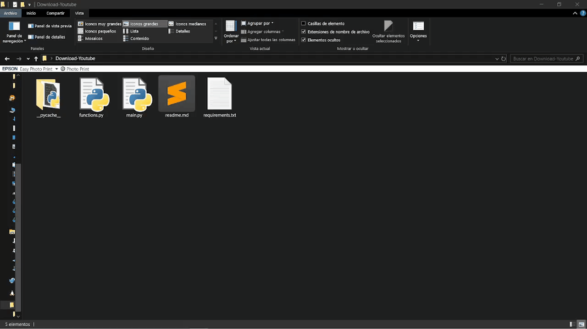

# YouTube Video Downloader
Easily download high-definition YouTube videos or extract audio files using this Python application. Built with the `yt-dlp` library for downloads, the app processes video and audio files using `ffmpeg` and features a graphical user interface powered by `customtkinter`.

## Features
- **Video Downloads**: Download high-quality videos directly from YouTube.
- **Audio Extraction**: Extract audio from videos and save in popular formats.
- **File Conversion**: Convert between various video and audio formats using `ffmpeg`.
- **High-Speed Downloads**: Enjoy optimized download speeds with `yt-dlp`.

## Requirements
Ensure you have the following tools and libraries installed before using the app:
- **Python 3.x**
- Python libraries (install via `requirements.txt`):
  - `yt-dlp`
  - `customtkinter`
  - `tkinter` (standard library)
- **ffmpeg**: Required for processing and converting video/audio files.

## Installation
Follow these steps to set up and run the application:

### 1. Install `ffmpeg`
- **Windows**: 
  - Download the latest release from [ffmpeg.org](https://ffmpeg.org/download.html). 
  - Extract the files and add the `ffmpeg` binary to your system's environment variables.

### 2. Install Python Libraries
Ensure you are in the project directory (e.g., `./Youtube-Video-Downloader` ) and install the required libraries:
```sh
pip install -r requirements.txt
```
---- 
# How to Use
1. Run the `main.py` script to launch the application.

