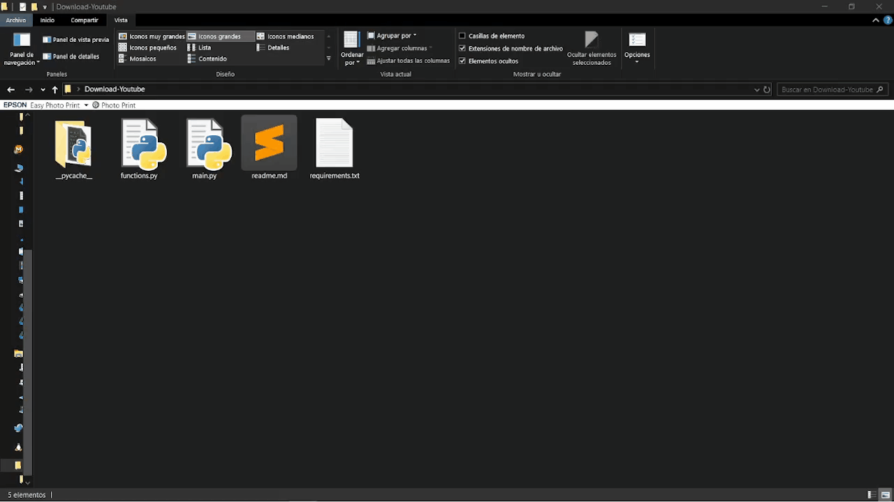

# YouTube Video Downloader

Easily download high-definition YouTube videos or extract audio files using this Python application. Built with the `yt-dlp` library for downloads, the app processes video and audio files using `ffmpeg` and features a graphical user interface powered by `customtkinter`.

## Features

- **Video Downloads**: Download high-quality videos directly from YouTube.
- **Audio Extraction**: Extract audio from videos and save in popular formats.
- **File Conversion**: Convert between various video and audio formats using `ffmpeg`.
- **High-Speed Downloads**: Enjoy optimized download speeds with `yt-dlp`.

## Requirements

Ensure you have the following tools and libraries installed before using the app:

- **Python 3.x**
- Python libraries (install via `requirements.txt`):
  - `yt-dlp`
  - `customtkinter`
  - `tkinter` (standard library)
- **ffmpeg**: Required for processing and converting video/audio files.

## Installation

### 1. Install ffmpeg

> For a step-by-step guide, you can watch this [VIDEO TUTORIAL](https://youtu.be/JR36oH35Fgg?si=kCmyZ2JoZU-_WT4n) or follow the instructions below:

1. Visit the official [FFmpeg download page](https://ffmpeg.org/download.html).
2. Select the "Windows" option and download the latest **build by BtbN** (e.g., `ffmpeg-master-latest-win64-gpl.zip`).
3. Extract the files to a directory (e.g., `C:\ffmpeg`).
4. Add your ffmpeg directory to your system's PATH environment variable:
   - Copy the path to the `bin` folder inside the extracted ffmpeg directory (e.g., `C:\ffmpeg\bin`).
   - Search for `Environment Variables` in the Windows search bar.
   - Click on "Edit the system environment variables."
   - In the System Variables section, find the `Path` variable and select it by clicking on it.
   - Click "New" to add the path to your ffmpeg bin directory (e.g., `C:\ffmpeg\bin`).
   - Paste the copied path and click "OK" to save the changes.

To verify the installation, open a command prompt and run:

```sh
ffmpeg -version
```

### 2. Install Python Libraries

Ensure you are in the project directory (e.g., `./Youtube-Video-Downloader` ) and install the required libraries:

```sh
pip install -r requirements.txt
```

## How to Use
If you have installed all the requirements, and you have followed the instructions above, you can run the application by executing the `main.py` script.


